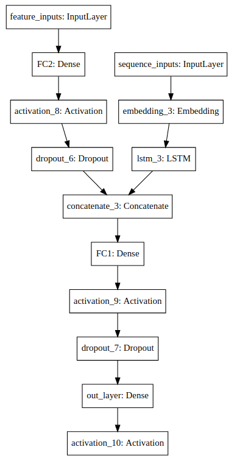

# Text Classification with Keras and SciKitLearn

## Problem

Implement an algorithm capable of identifying the speaker (French Presidents Chirac vs Mitterrand) of a part of a political speech.
(ArturIn Deep Learning test)

A labelled dataset is given for learning.

## Data

Data are in Pickle format.

`sequences` are preprocessed versions  of `sentences`. Tokenization dictionnary is given as well.

`Test/` directory are not labelled.

## Purpose

Predict labels from  `Test` (results have to be given in the same format as `Learn`).

## Chosen Neural Network

The concatenation of a LSTM network, for dealing with sequences, and a dense network
for dealing with the extracted features was chosen.

Here is the graph of its architecture (plotted with `IPython.diplay.SVG` and `keras.utils.vis_utils.model_to_dot`) :



## Structure of the solution

Code is given in Python 3.6.

Solution contains custom package `text_classification` and exploration, preprocessing, training and prediction notebooks.
Les packages utilisés sont décrits dans `requirements.txt`.

In order to use the notebooks, simply run in a virtualenv Python 3:

```sh
pip install -r requirement.txt

pip install text_classification
```

`exploration.ipynb` and `full_pipeline.ipynb` notebooks can be ran from end to end.

* Predictions on `Test/` are given in `/Data/Test/predicted_labels.pkl`

* `/text_classification/` content:

    - `preprocess_sequences.py`: applies preprocessing on sequences from `/Data/Learn/sequences.pkl` and `/Data/Test/sequences.pkl`.

    Preprocessing consists in contraining sequence length to a maximum size (133 was chosen because 99.9% of lengths are smaller than 133, but this is a parameter that can be hyperoptimized), removing tokens that were less important according to TF-IDF representation. This allows to remove lengths outliers and consequently to contraint padding influence (at input of LSTM layer) on predictions, and speeds up learning.

    - `extract_features.py`: applies preprocessing on text sentences to extract additional features.

    For instance, sequence size, number of characters, density are extracted.

    In addition TF-IDF word representations are extracted, as well as n-grams and character n-grams (2-3). Dimensionality reduction is applied on these features using SVD Matrix Factorization, for Latent Semantic Analysis (LSA).

    These extracted features are fit on the Learn set and applied on both the Learn and Test sets.

    - `load_data.py`: allows to load data from Learn and Test as `pd.DataFrame`.

    - `model.py`: defines used Keras models class.


* Notebooks content:

  - `exploration.ipynb` : quick exploration notebook.

  - `full_pipeline.ipynb` : preprocessing for `Learn` and `Test`, training loop definition, model selection and prediction. This notebook imports `text_classification`.

## Progression

- Data exploration (see `exploration.ipynb`)
- Simple Keras RNN model training on sequences only
- Additional feature extraction (with `/text_classification/extract_features.py`)
- Keras model definition for taking additional features into account
- Sequence length reduction (with `/text_classification/preprocess_sequences.py`)
- Network hyperparameter selection using Early Stopping and Cross Validation
- Final model training with all Learn data and prediction on Test

## Approach

This is a binary classification problem with an unbalanced dataset (see `exploration.ipynb`), and we have to give predictions on a given dataset. Consequently, the threshold is fixed and we can choose F1-score as optimization metric. Maximum F1-score is the chosen metric for Early Stopping. In addition, the threshold that maximizes F1-score is not necessarily 0.5, so we have to come up with a way to compute the best threshold for prediction as well.

### Hyperparameter selection

The chosen approach consists in selecting a 10% Test set artificially among Learn data (Stratified Split is used in order to reproduce target distribution in splits). A Random Grid Search is then performed for hyperparameter selection. The 90% data that are left are split in 5 stratified folds on which Cross Validation is performed (training on 4 folds, early stopping on the 5th one and so on). Performance of each model is monitored on the Test set chosen at the beginning.

The best hyperparameters are those that lead to the best max F1-score ( averaged over the 5 models) on the artificial Test set.

For a given hyperparameter set, the 5 trained models are then stacked (taking the average of the predictions on the artificial Test set) in order to monitor if F1-score is improving.

### Training final model

Once the best hyperparameter set is chosen, 5 models are trained on the whole Train set using Cross Validation and Early Stopping on max F1-score and the average of their scores on the real Test set is taken. We then predict labels corresponding to the average of the thresholds that maximize the F1-score on each validation set. 
